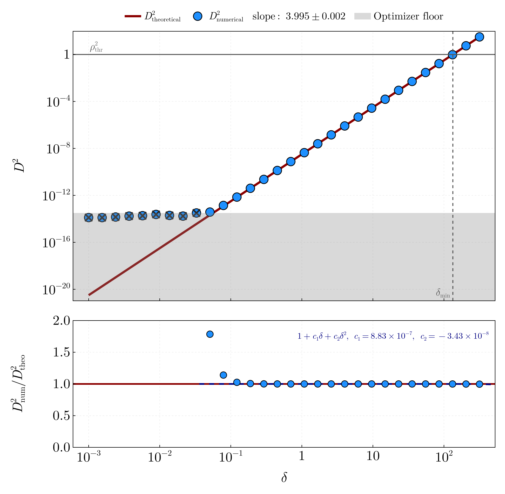
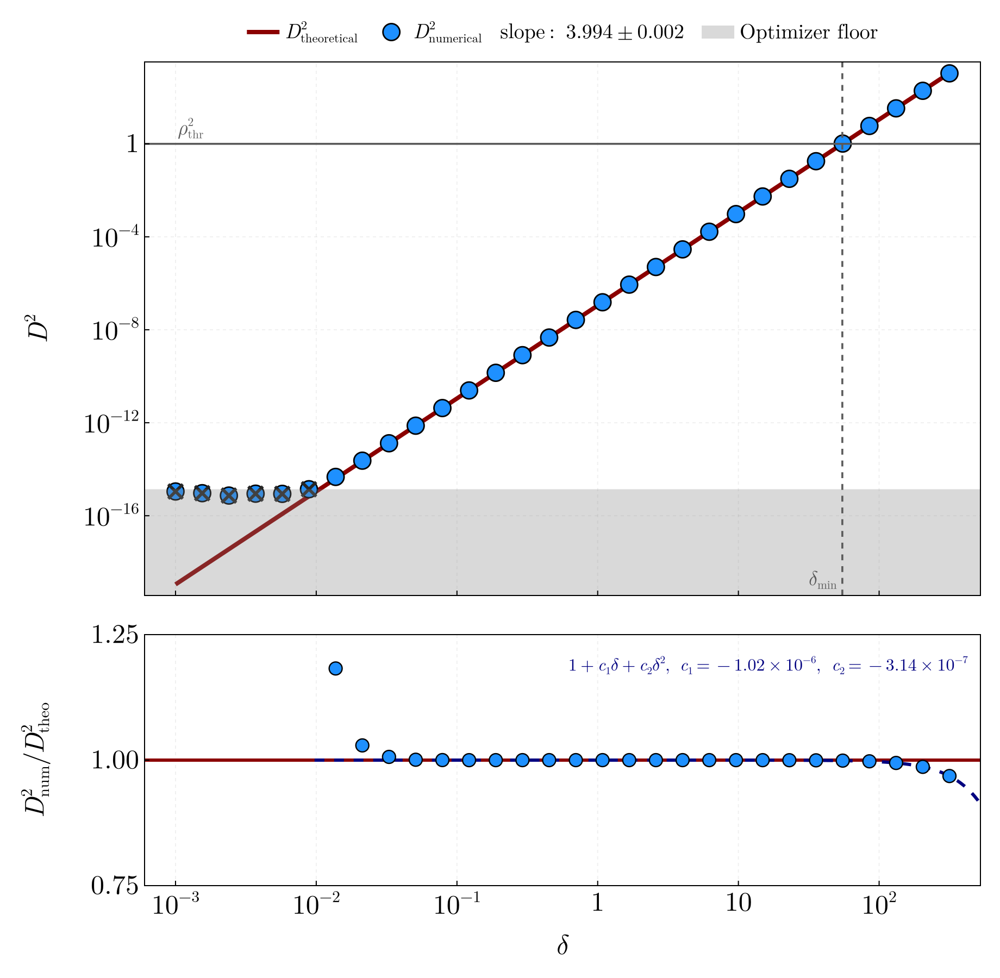

# CurvatureDistinguishability

A Julia pipeline that validates the quartic distinguishability law for
overlapping gravitational-wave signals and maps the physically capped
"zone of confusion" for a LISA-like detector.

When data contain two closely overlapping signals with a small parameter
separation ``\delta``, a single-source fit absorbs the linear and quadratic
differences; the unabsorbable residual is governed by the extrinsic
curvature ``K(u)`` of the signal manifold:

```math
D^2 \approx \frac{1}{16} K(u)\, \delta^4,
\qquad
\delta_{\mathrm{min}}(u) = \left(\frac{16\,\rho_{\mathrm{thr}}^2}{K(u)}\right)^{1/4}.
```

The published zone-of-confusion maps are the exact intersection of this
mathematical boundary with the hard physical parameter bounds
(``D_L, \mathcal{M}, t_c \ge 0``, ``|\chi| \le 1``, phase topology
``\pm\pi``) — along degenerate directions (e.g. the spin combination the
1.5PN phase cannot see) the zone is limited by the prior, not by
curvature, and the figures mark those boundary segments distinctly.

Both figures below are sweeps of the production configuration
(`configs/production_cpu.toml`, a one-year observation on 1.57 × 10⁶
frequency bins): the six-dimensional diagonal direction of a distant
moderate-mass binary, and the chirp-mass/coalescence-time direction of a
massive aligned-spin binary.





The repository README is the operational reference (file structure,
environment setup, usage, component status). This documentation covers the
deeper layers:

- [System Architecture](architecture.md) — module inventory, data flow,
  GPU path and extension points.
- [Scientific Context](science.md) — the source-confusion problem and the
  geometric formulation.
- [Waveform Physics](physics.md) — the 1.5PN inspiral model, constellation
  response and noise model.
- [Complex Run Parameters](parameters.md) — the physical rationale of the
  production configuration's sweeps and maps.
- [Roadmap](roadmap.md) — planned extensions with design sketches, and GPU
  operational notes.
- [API Reference](api.md) — every public symbol.

Quickest start: `julia --threads=auto scripts/run_pipeline.jl`
runs the minutes-scale `configs/quickstart.toml` scenario end to end and
demonstrates the scaling law, the optimizer floor, and the prior-limited
spin wedge.
